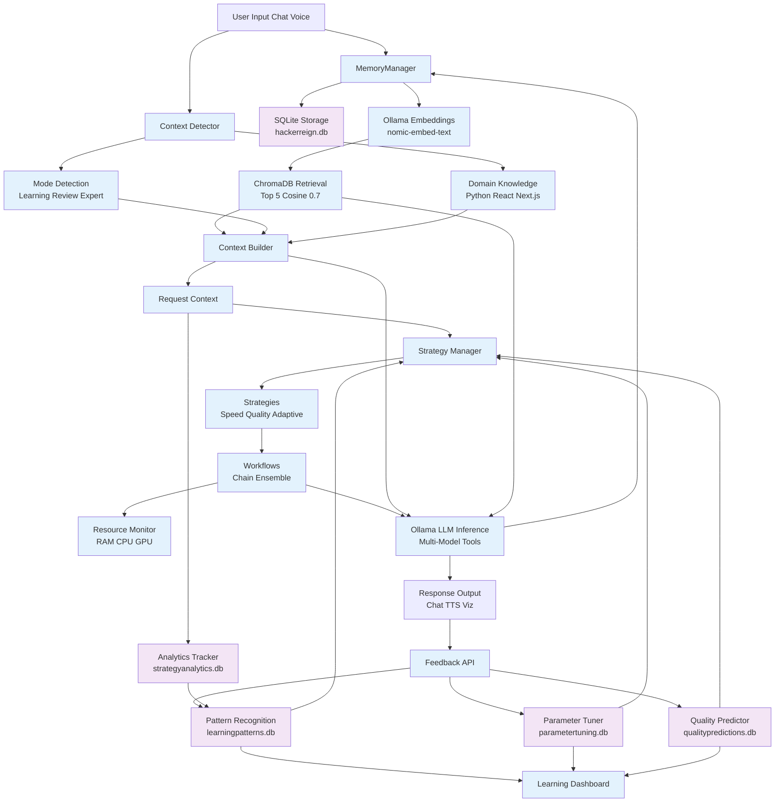

Hacker Reign processes information through interconnected systems like strategy selection, domain context, memory RAG, and LLM orchestration, as detailed in the project documentation.

## Overall Flow
User input enters via chat or voice, triggering context analysis for mode, domain, and complexity. Strategy system selects optimal LLM model and workflow, augmented by RAG retrieval from memory.

Memory retrieves similar past conversations using embeddings and vector search before LLM inference.

## Detailed Granular Flowchart

## Memory System Breakdown
- **SQLite (hackerreign.db)**: Persistent conversations/messages with schema migrations.
- **ChromaDB (.data/chroma)**: Vector store for semantic search.
- **Embeddings**: Ollama nomic-embed-text (384-dim), generated on save.
- **Retrieval**: Cosine similarity, top-5, threshold 0.7, metadata filtering.

## Domain Selection Mechanics
- **Detection Signals**: Keywords ('explain'), file extensions (.py/.tsx), code patterns (async/hooks).
- **Modes**: Learning (patient, examples), Code-Review (critical fixes), Expert (trade-offs).
- **Dynamic Params**: Temp 0.3-0.5, tokens 6k-8k per mode.

## Context Building Process
Merges: Mode instructions + Domain knowledge (e.g., asyncio patterns) + RAG history → single enriched system prompt for LLM.

## Continual Learning Components
- **PatternRecognition**: Tracks mode+domain+model → success rate in learningpatterns.db.
- **ParameterTuner**: A/B tests temp/top-p/maxTokens → parametertuning.db.
- **QualityPredictor**: ML pre-gen score (0-100) → qualitypredictions.db, influences routing.
- **Feedback Loop**: api/feedback → all systems + LearningDashboard visualization.
